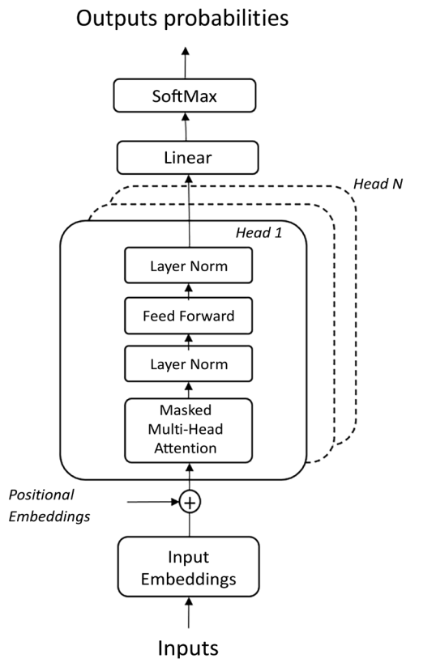
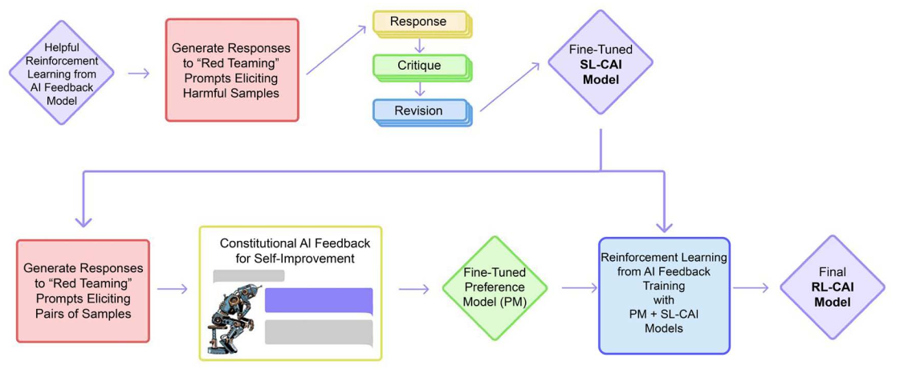
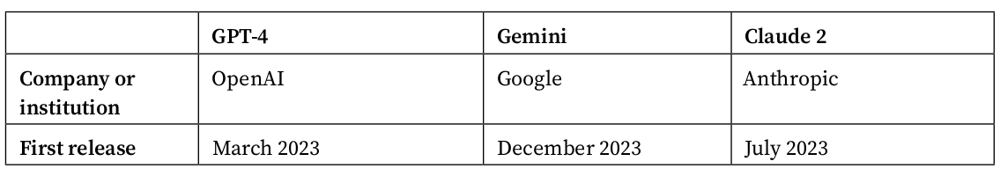
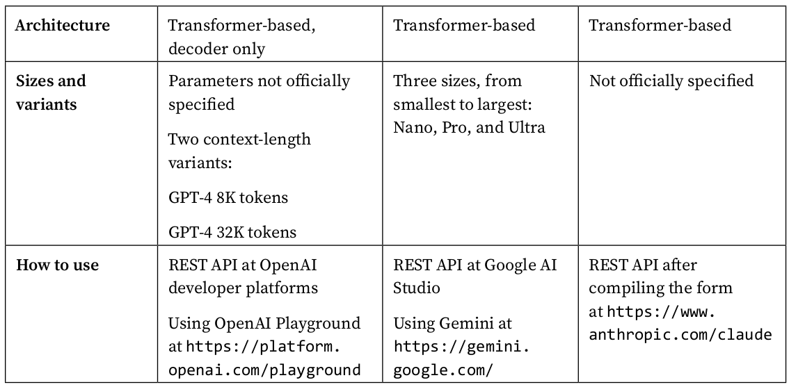
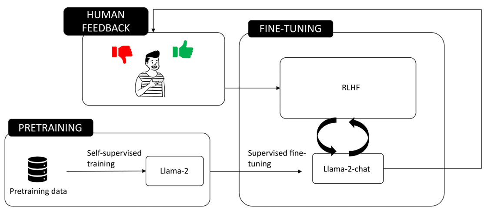
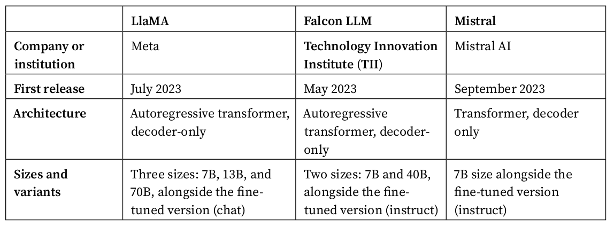
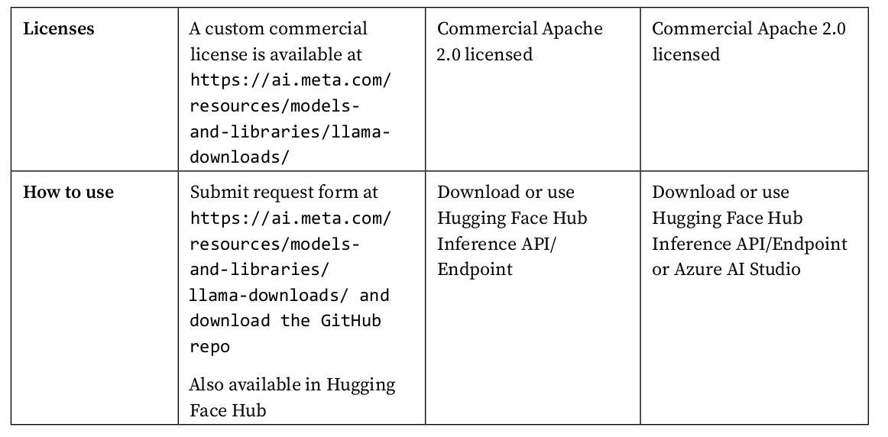

# Choosing an LLM for Your Application

## GPT-4

It belongs to the class of generative pretrained transformer (GPT) models, a decoder-only transformer-based architecture introduced by OpenAI. The following diagram shows the basic architecture:

---
Hallucination is a term that describes a phenomenon where LLMs generate text that is
incorrect, nonsensical, or not real, but appears to be plausible or coherent. For example,
an LLM may hallucinate a fact that contradicts the source or common knowledge, a name
that does not exist, or a sentence that does not make sense.

---

## Gemini 1.5

Gemini 1.5 is a SOTA generative AI model developed by Google and released in December 2023. Like
GPT-4, Gemini is designed to be multimodal, meaning that it can process and generate content across
various modalities, including text, images, audio, video, and code. It is based on a mixture-of-expert
(MoE) transformer.

Gemini comes in various sizes, including Ultra, Pro, and Nano, to cater to different computational needs,
from data centers to mobile devices.

## Claude 2

Claude 2, which stands for Constitutional Large-scale Alignment via User Data and Expertise, is an
LLM developed by Anthropic, a research company founded by former OpenAI researchers and focused
on AI safety and alignment. It was announced in July 2023.

The following illustration shows the training process according to the CAI technique:

## Summary

---

## LLaMA-2

Large Language Model Meta AI 2 (LLaMA-2) is a new family of models developed by Meta and un-
veiled to the public on July 18, 2023, open source and for free (its first version was originally limited
to researchers).

The following is an illustration of how the training process for LLaMA works:

## Falcon LLM

Falcon LLM is an open-source model launched by Abu Dhabi’s Technology Innovation Institute (TII)
in May 2023. It is an autoregressive, decoder-only transformer, trained on 1 trillion tokens, and it has
40 billion parameters (even though it has also been released as a lighter version with 7 billion param-
eters). Similarly to what we saw for LlaMA, Falcon LLM also comes with a fine-tuned variant, called
“Instruct,” which is tailored toward following the user’s instructions.

## Mistral

The Mistral model, particularly the Mistral-7B-v0.1, is a decoder-only transformer with 7.3 billion
parameters, designed for generative text tasks. It’s known for its innovative architecture choices like
grouped-query attention (GQA) and sliding-window attention (SWA), which have allowed it to out-
perform other models in benchmarks.

GQA is a technique that allows for faster inference times compared to standard full atten-
tion mechanisms. It does this by partitioning the attention mechanism’s query heads into
groups, with each group sharing a single key head and value head.

SWA is used to handle longer text sequences efficiently. It extends the model’s attention
beyond a fixed window size, allowing each layer to reference a range of positions from
the preceding layer. This means that the hidden state at a certain position in one layer
can attend to hidden states within a specific range in the previous layer, thus enabling the
model to access tokens at a greater distance and manage sequences of varying lengths
with a reduced inference cost.

## summary

s