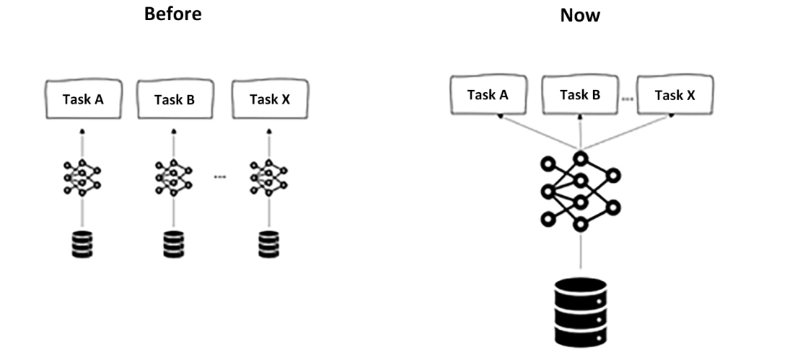
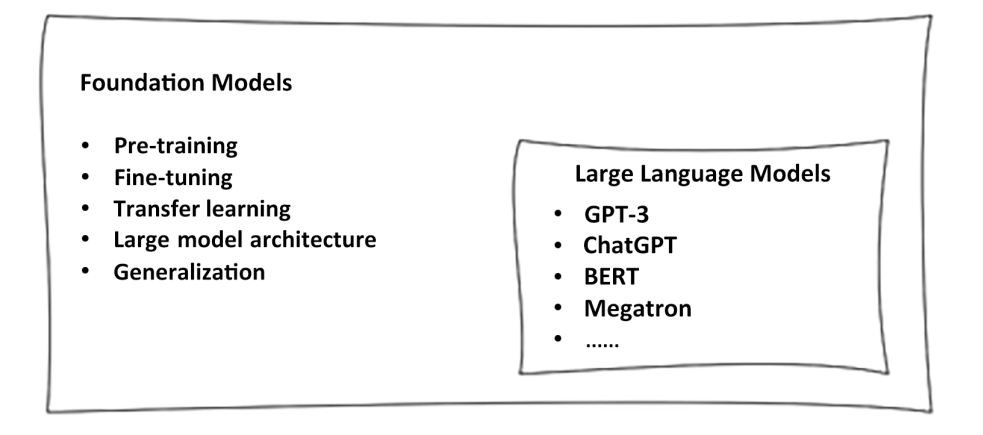
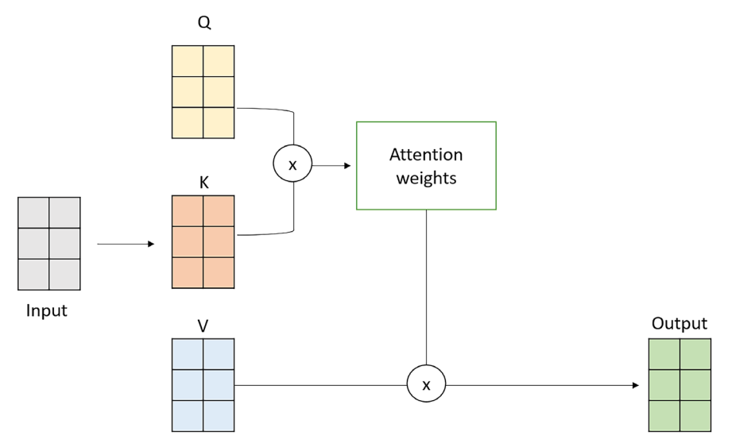
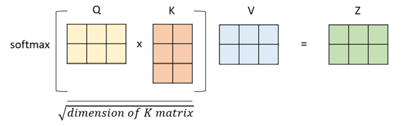
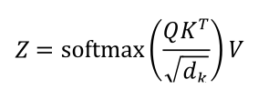
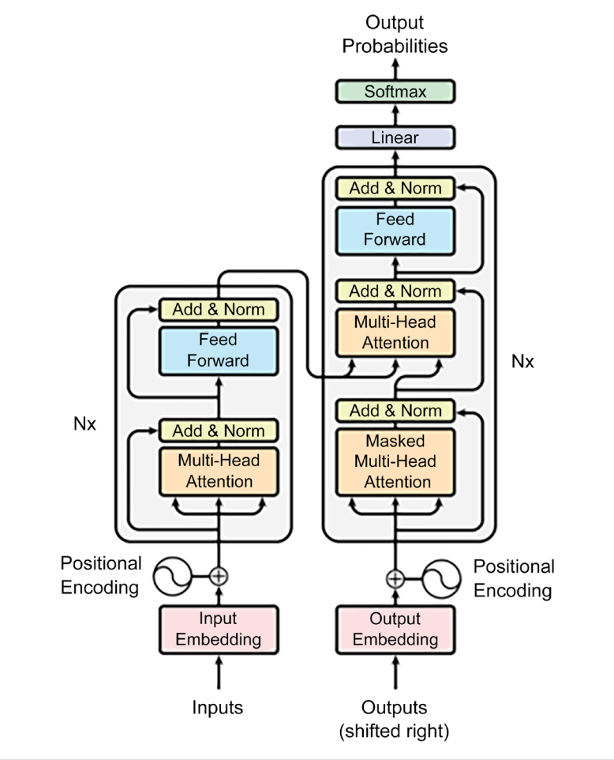

## AI paradigm shift – an introduction to foundation models
A foundation model refers to a type of pre-trained generative AI model that offers immense versatility
by being adaptable for various specific tasks. These models undergo extensive training on vast and
diverse datasets, enabling them to grasp general patterns and relationships within the data – not just
limited to textual but also covering other data formats such as images, audio, and video.

Foundation models are designed with transfer learning in mind, meaning they can effectively apply
the knowledge acquired during pre-training to new, related tasks. This transfer of knowledge en-
hances their adaptability, making them efficient at quickly mastering new tasks with relatively little
additional training.

This paradigm shift in artificial neural network design offers considerable advantages, as foundation
models, with their diverse training datasets, can adapt to different tasks based on users’ intent without
compromising performance or efficiency. In the past, creating and training distinct neural networks
for each task, such as named entity recognition or sentiment analysis, would have been necessary, but
now, foundation models provide a unified and powerful solution for multiple applications.

LFMs are trained on a huge amount of heterogeneous data in different formats.
Whenever that data is unstructured, natural language data, we refer to the output LFM as an LLM,
due to its focus on text understanding and generation.

---
## Transformers

In the transformer architecture, “attention” is a mechanism that enables the model to
focus on relevant parts of the input sequence while generating the output.

Self-attention layers are responsible for determining the importance of each input
token in generating the output. Those answer the question: “Which part of the input should I focus on?”

In order to obtain the self-attention vector for a sentence, the elements we need are “value”, “query”,
and “key.” These matrices are used to calculate attention scores between the elements in the input
sequence and are the three weight matrices that are learned during the training process (typically
initialized with random values). More specifically, their purpose is as follows:

• Query (Q) is used to represent the current focus of the attention mechanism

•Key (K) is used to determine which parts of the input should be given attention

•Value (V) is used to compute the context vectors

---
## some tips

the quality and diversity of the output text depend largely on two factors:
the training dataset and the evaluation metric.

