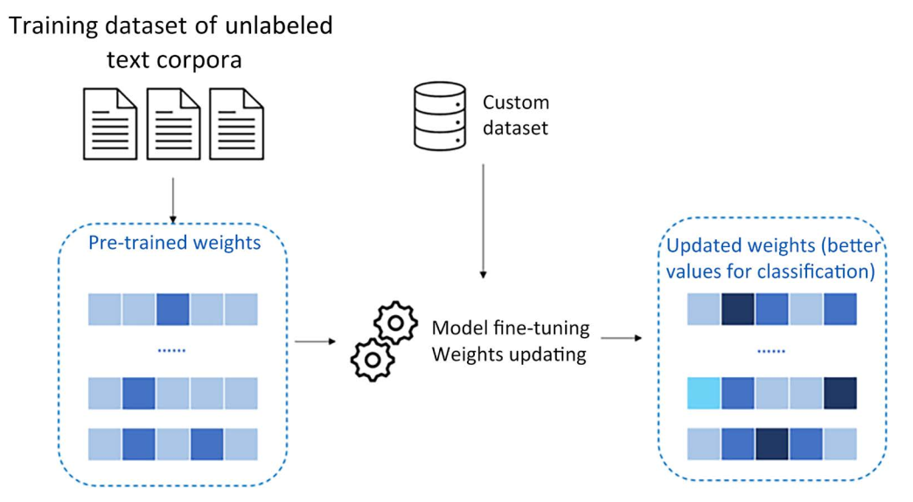

## AI paradigm shift – an introduction to foundation models
A foundation model refers to a type of pre-trained generative AI model that offers immense versatility
by being adaptable for various specific tasks. These models undergo extensive training on vast and
diverse datasets, enabling them to grasp general patterns and relationships within the data – not just
limited to textual but also covering other data formats such as images, audio, and video.

Foundation models are designed with transfer learning in mind, meaning they can effectively apply
the knowledge acquired during pre-training to new, related tasks. This transfer of knowledge en-
hances their adaptability, making them efficient at quickly mastering new tasks with relatively little
additional training.

This paradigm shift in artificial neural network design offers considerable advantages, as foundation
models, with their diverse training datasets, can adapt to different tasks based on users’ intent without
compromising performance or efficiency. In the past, creating and training distinct neural networks
for each task, such as named entity recognition or sentiment analysis, would have been necessary, but
now, foundation models provide a unified and powerful solution for multiple applications.

LFMs are trained on a huge amount of heterogeneous data in different formats.
Whenever that data is unstructured, natural language data, we refer to the output LFM as an LLM,
due to its focus on text understanding and generation.

---
## Transformers

In the transformer architecture, “attention” is a mechanism that enables the model to
focus on relevant parts of the input sequence while generating the output.

Self-attention layers are responsible for determining the importance of each input
token in generating the output. Those answer the question: “Which part of the input should I focus on?”

In order to obtain the self-attention vector for a sentence, the elements we need are “value”, “query”,
and “key.” These matrices are used to calculate attention scores between the elements in the input
sequence and are the three weight matrices that are learned during the training process (typically
initialized with random values). More specifically, their purpose is as follows:

• Query (Q) is used to represent the current focus of the attention mechanism

•Key (K) is used to determine which parts of the input should be given attention

•Value (V) is used to compute the context vectors

---
## some tips

the quality and diversity of the output text depend largely on two factors:
the training dataset and the evaluation metric.

The following are the main steps involved in the training process of an LLM:

1. Data collection
2. Data preprocessing
3. Model architecture
4. Model initialization
5. Model pre-training
6. Fine-tuning
7. Reinforcement learning from human feedback (RLHF)

## Model evaluation

When it comes to LLMs, the story is a bit different. As those models are trained on unlabeled text and
are not task-specific, but rather generic and adaptable given a user’s prompt, traditional evaluation
metrics were not suitable anymore. Evaluating an LLM means, among other things, measuring its
language fluency, coherence, and ability to emulate different styles depending on the user’s request.

The following are the most popular frameworks used to evaluate LLMs:

- General Language Understanding Evaluation (GLUE) and SuperGLUE: This benchmark is used to measure the performance of LLMs on various NLU tasks, such as sentiment analysis, natural language inference, question answering, etc. The higher the score on the GLUE benchmark, the better the LLM is at generalizing across different tasks and domains.

- Massive Multitask Language Understanding (MMLU): This benchmark measures the knowledge of an LLM using zero-shot and few-shot settings.

- HellaSwag: The HellaSwag evaluation framework is a method of evaluating LLMs on their ability to generate plausible and common sense continuations for given contexts. It is based on the HellaSwag dataset, which is a collection of 70,000 multiple-choice questions that cover diverse domains and genres, such as books, movies, recipes, etc.

- TruthfulQA: This benchmark evaluates a language model’s accuracy in generating responses to questions. It includes 817 questions across 38 categories like health, law, finance, and politics. The questions are designed to mimic those that humans might answer incorrectly due to false beliefs or misunderstandings.

- AI2 Reasoning Challenge (ARC): This benchmark is used to measure LLMs’ reasoning capabilities and to stimulate the development of models that can perform complex NLU tasks.

---
## How to customize your model
There are three main ways to customize your model:

- Extending non-parametric knowledge: This allows the model to access external sources of information to integrate its parametric knowledge while responding to the user’s query.

LLMs exhibit two types of knowledge: parametric and non-parametric. The
parametric knowledge is the one embedded in the LLM’s parameters, deriving
from the unlabeled text corpora during the training phase. On the other hand, non-parametric knowledge is the one we can “attach” to the model via embedded documentation. Non-parametric knowledge doesn’t change the structure of the model, but rather, allows it to navigate through external documentation to be used as relevant context to answer the user’s query.

- Few-shot learning: In this type of model customization, the LLM is given a metaprompt with a small number of examples (typically between 3 and 5) of each new task it is asked to perform. The model must use its prior knowledge to generalize from these examples to perform the task.

> A metaprompt is a message or instruction that can be used to improve the performance of LLMs on new tasks with a few examples.

- Fine tuning: The fine-tuning process involves using smaller, task-specific datasets to customize the foundation models for particular applications. 

