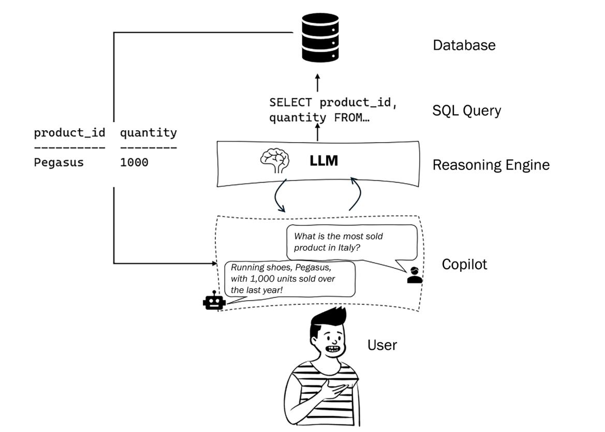
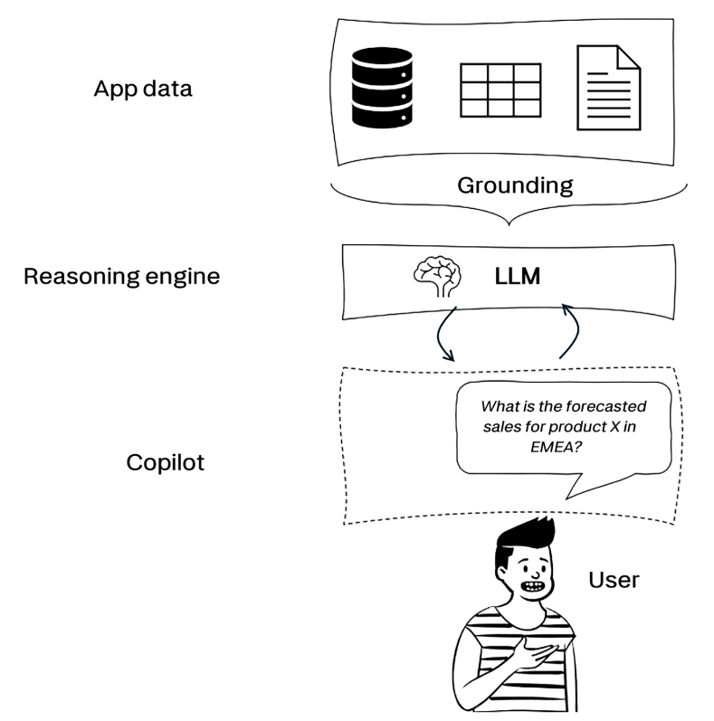
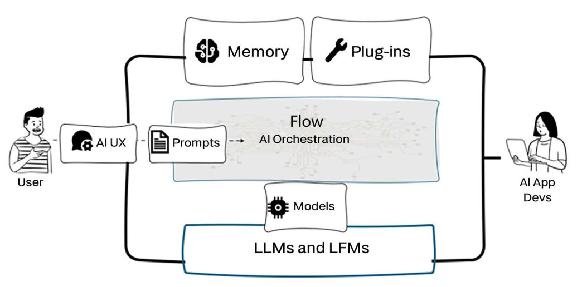
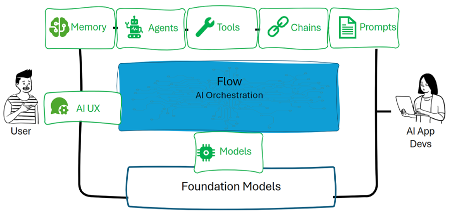
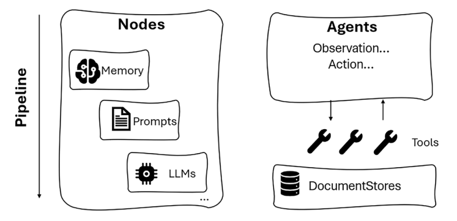
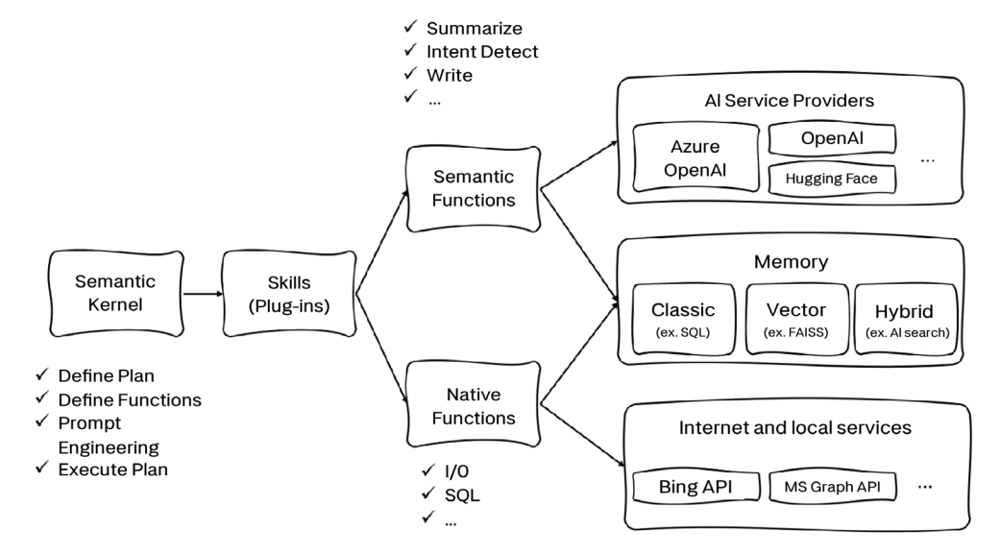
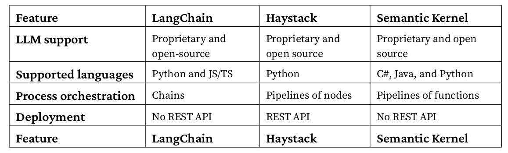

# LLMs for AI-Powered Applications

## the copilot system

Grounding is achieved through an architectural framework called retrieval-augmented generation (RAG), a technique that enhances the output of LLMs by incorporating information from an external, authoritative knowledge base before generating a response. This process helps to ensure that the generated content is relevant, accurate, and up to date.

What is the difference between a copilot and a RAG? RAG can be seen as one of the architectural patterns that feature a copilot. Whenever we want our copilot to be grounded to domain-specific data, we use a RAG framework. Note that RAG is not the only architectural pattern that can feature a copilot: there are further frameworks such as function calling or multi-agents.

Note that the user’s prompt in natural language is not the only input the model processes. In fact, it is
a crucial component of the backend logic of our LLM-powered applications and the set of instructions
we provide to the model. This metaprompt or system message is the object of a new discipline called
prompt engineering.

open source models: Falcon LLM, developed by Abu Dhabi’s Technology Innovation Institute (TII), or LLaMA, developed by Meta.

---

## LangChain

LangChain was launched as an open-source project by Harrison Chase in October 2022. It can be used
both in Python and JS/TS. It is a framework for developing applications powered by language models,
making them data-aware (with grounding) and agentic – which means they are able to interact with
external environments.

## Haystack

Haystack is a Python-based framework developed by Deepset, a startup founded in 2018 in Berlin
by Milos Rusic, Malte Pietsch, and Timo Möller. Deepset provides developers with the tools to build
natural language processing (NLP)-based applications, and with the introduction of Haystack, they
are taking them to the next level.

## Semantic Kernel

It was developed by Microsoft, originally in C# and now also available in Python.

## summary

