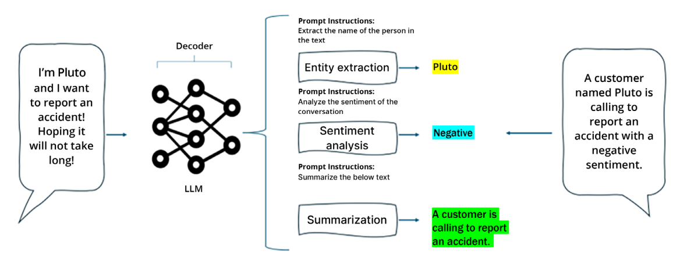

# Prompt Engineering

## What is prompt engineering?

A prompt is a text input that guides the behavior of an LLM to generate a text output.

repeating the main instruction at the end of the prompt can help the model overcome its inner recency bias.

Recency bias is the tendency of LLMs to give more weight to the information that appears
near the end of a prompt, and ignore or forget the information that appears earlier. This
can lead to inaccurate or inconsistent responses that do not take into account the whole
context of the task. For example, if the prompt is a long conversation between two peo-
ple, the model may only focus on the last few messages and disregard the previous ones.

## Few-shot approach

In their paper Language Models are Few-Shot Learners, Tom Brown et al. demonstrate that GPT-3 can
achieve strong performance on many NLP tasks in a few-shot setting. This means that for all tasks,
GPT-3 is applied without any fine-tuning, with tasks and few-shot demonstrations specified purely via
text interaction with the model.

This is an example and evidence of how the concept of few-shot learning – which means providing
the model with examples of how we would like it to respond – is a powerful technique that enables
model customization without interfering with the overall architecture.

## Chain of thought

Introduced in the paper Chain-of-Thought Prompting Elicits Reasoning in Large Language Models by
Wei et al., chain of thought (CoT) is a technique that enables complex reasoning capabilities through
intermediate reasoning steps. It also encourages the model to explain its reasoning, “forcing” it not
to be too fast and risking giving the wrong response.

## ReAct

Introduced in the paper ReAct: Synergizing Reasoning and Acting in Language Models by Yao et al., ReAct
(Reason and Act) is a general paradigm that combines reasoning and acting with LLMs. ReAct prompts
the language model to generate verbal reasoning traces and actions for a task, and also receives ob-
servations from external sources such as web searches or databases. This allows the language model
to perform dynamic reasoning and quickly adapt its action plan based on external information. For
example, you can prompt the language model to answer a question by first reasoning about the question,
then performing an action to send a query to the web, then receiving an observation from the search
results, and then continuing with this thought, action, observation loop until it reaches a conclusion.

The difference between CoT and ReAct approaches is that CoT prompts the language model to gen-
erate intermediate reasoning steps for a task, while ReAct prompts the language model to generate
intermediate reasoning steps, actions, and observations for a task.

Note that the “action” phase is generally related to the possibility for our LLM to interact with external
tools, such as a web search.

