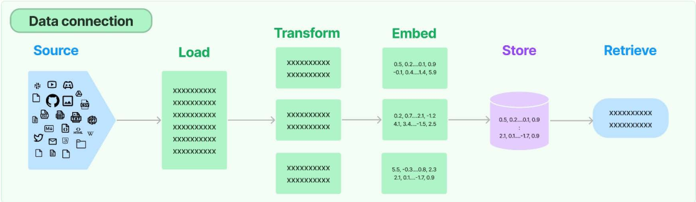
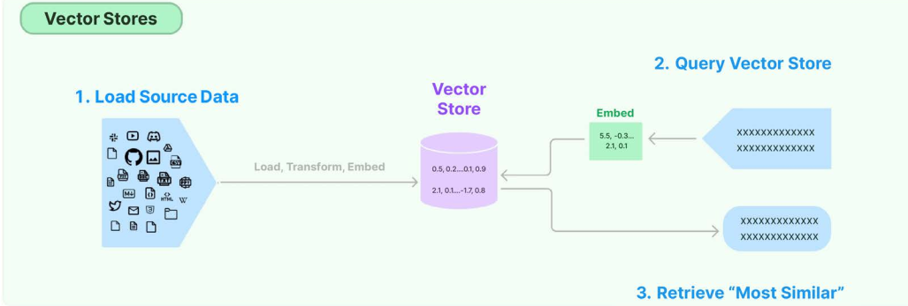

# Embedding LLMs within Your Applications

The idea is to cover the typical flow of incorporating user-specific data into applications that are made
of five main blocks, as illustrated in the following figure:

Retrievers: A retriever is a component in LangChain that can return documents relevant to
an unstructured query, such as a natural language question or a keyword. A retriever does
not need to store the documents itself, but only to retrieve them from a source. A retriever
can use different methods to find relevant documents, such as keyword matching, semantic
search, or ranking algorithms.
The difference between a retriever and a vector store is that a retriever is more general and
flexible than a vector store. A retriever can use any method to find relevant documents, while
a vector store relies on embeddings and similarity metrics. A retriever can also use different
sources of documents, such as web pages, databases, or files, while a vector store needs to
store the data itself.

---

## Chains

Chains are predetermined sequences of actions and calls to LLMs that make it easier to build complex
applications that require combining LLMs with each other or with other components.

- LLMChain: This is the most common type of chain. It consists of a prompt template, an LLM, and an optional output parser.

This chain takes multiple input variables, uses PromptTemplate to format them into a prompt,
passes it to the model, and then uses OutputParser (if provided) to parse the output of the
LLM into a final format.

- RouterChain: This is a type of chain that allows you to route the input variables to different
chains based on some conditions. You can specify the conditions as functions or expressions
that return a Boolean value. You can also specify the default chain to use if none of the con-
ditions are met.

- SequentialChain: This is a type of chain that allows you to execute multiple chains in a sequence.
You can specify the order of the chains and how they pass their outputs to the next chain. The
simplest module of a sequential chain, takes by default the output of one chain as the input
of the next chain. However, you can also use a more complex module to have more flexibility
to set input and output among chains.

- TransformationChain: This is a type of chain that allows you to transform the input variables
or the output of another chain using some functions or expressions. You can specify the trans-
formation as a function that takes the input or output as an argument and returns a new value,
as well as specify the output format of the chain.

---

## Agents

Agents are entities that drive decision-making within LLM-powered applications. They have access to
a suite of tools and can decide which tool to call based on the user input and the context. Agents are
dynamic and adaptive, meaning that they can change or adjust their actions based on the situation
or the goal: in fact, while in a chain, the sequence of actions is hardcoded, in agents, the LLM is used
as the reasoning engine with the goal of planning and executing the right actions in the right order.

