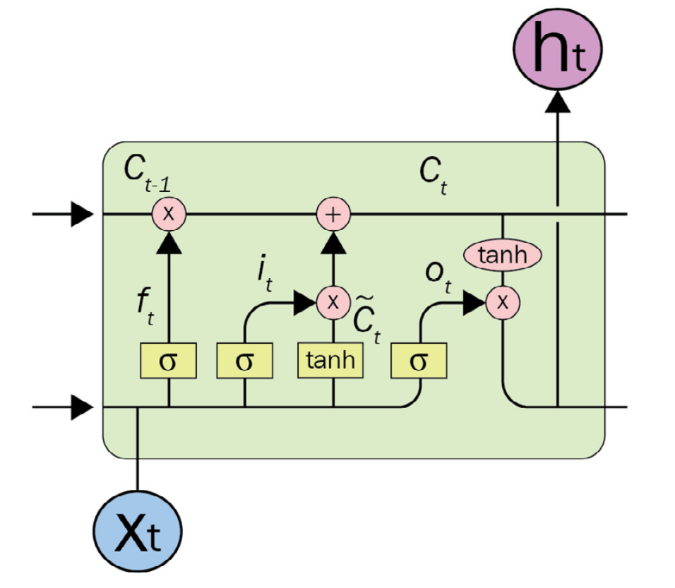
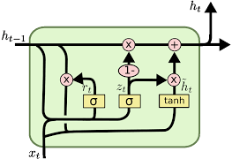
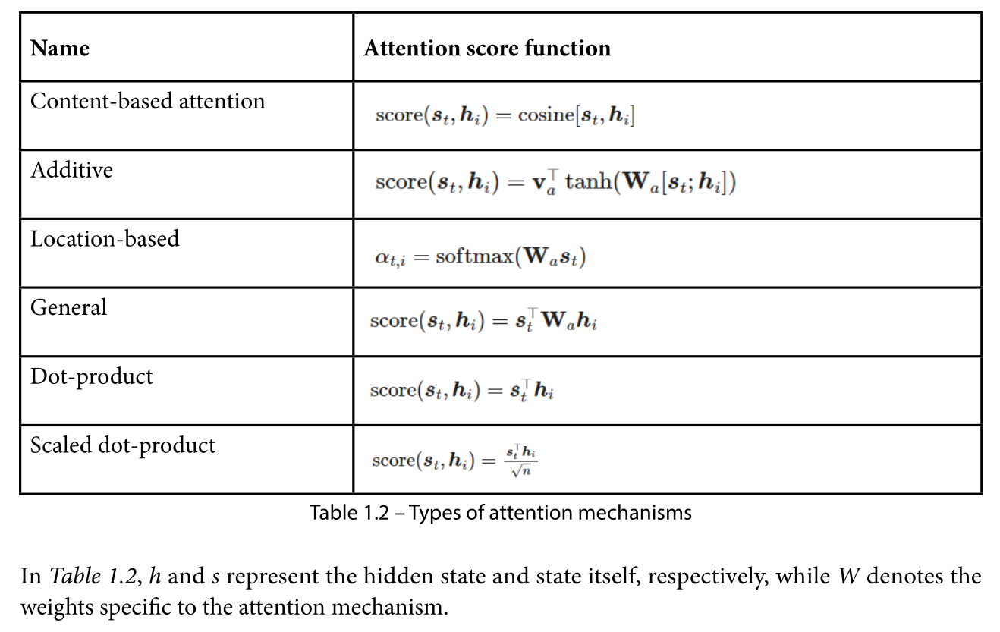
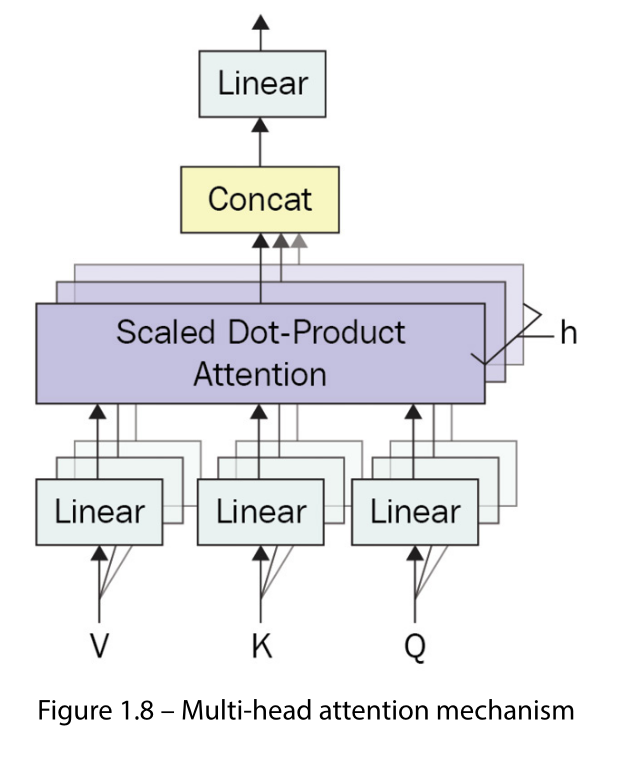
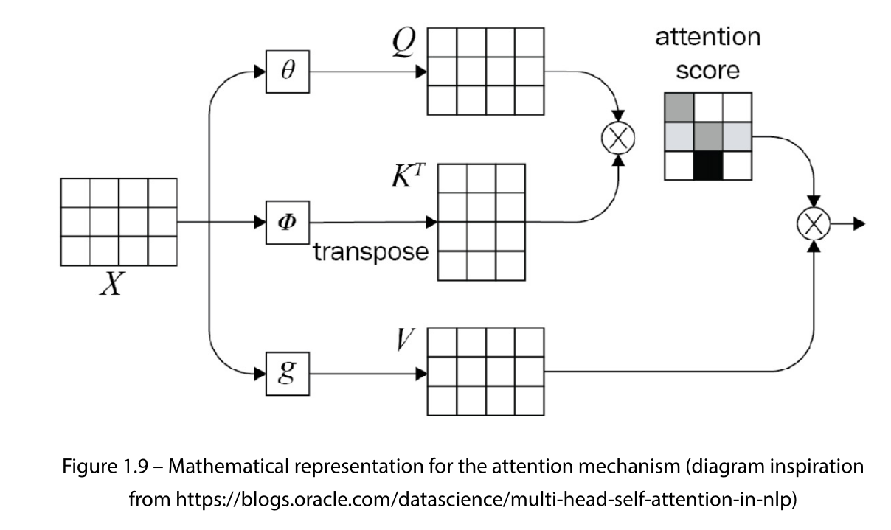
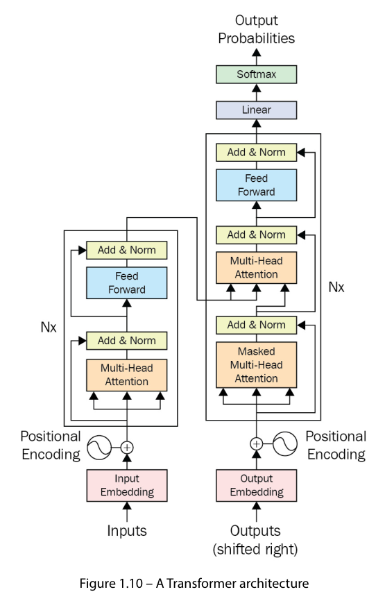
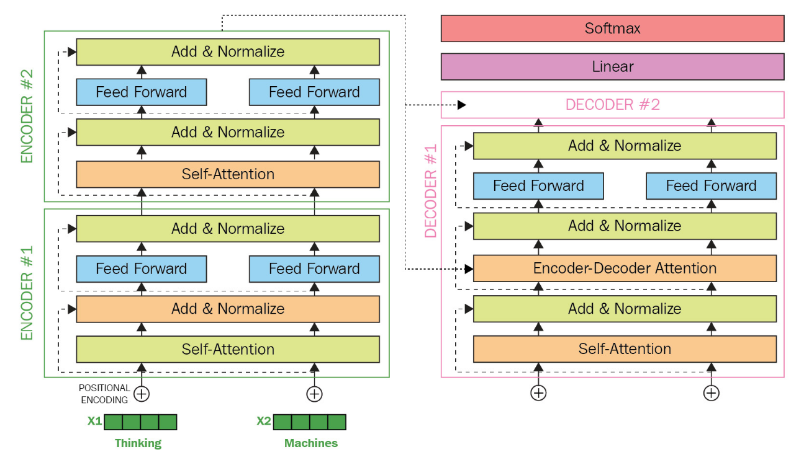
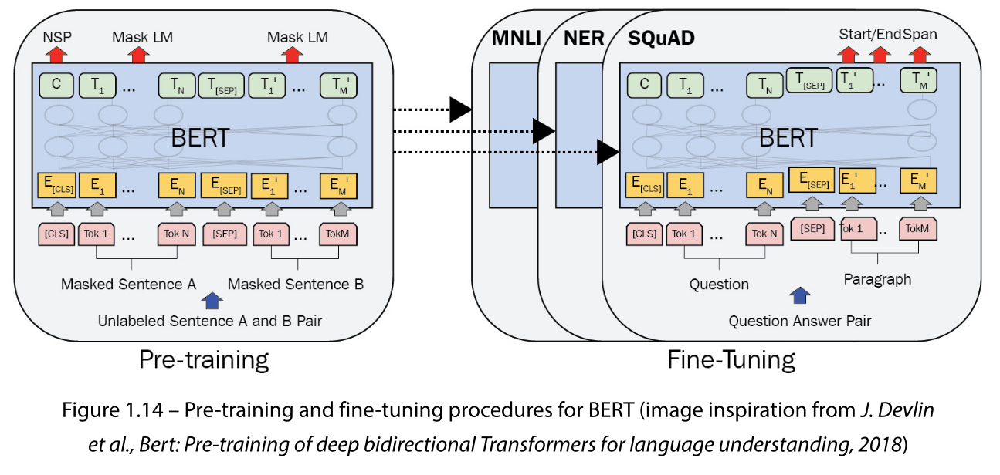

# From Bag-of-Words to the Transformers

contextual word embeddings:
- Universal Language Model Fine-tuning (ULMFiT)
- Embeddings from Language Models (ELMo)

### LSA
Latent semantic analysis (LSA) has been widely used to overcome the dimensionality problem of
the BoW model. It is a linear method that captures pairwise correlations between terms. LSA-based
probabilistic methods can still be considered as a single layer of hidden topic variables. However,
current DL models include multiple hidden layers, with billions of parameters. In addition to that,
Transformer-based models showed that they can discover latent representations much better than
such traditional models.

### FastText
FastText is another widely used model that incorporates subword information by representing each
word as a bag of character n-grams, with each n-gram represented by a constant vector. Words are then
represented as the sum of their sub-vectors, an idea first introduced by H. Schütze in 1993. This allows FastText to compute word representations even for unseen words (or rare words) and learn the internal
structure of words, such as suffixes and affixes, which is particularly useful for morphologically rich
languages.

well-known word-embedding algorithms :
- word2vec
- FastText

## LSTM
Long-Short Term Memory

One key feature of LSTMs is the
use of a cell state, which is a horizontal sequence line located above the LSTM unit and controlled by
specialized gates that handle forget, insert, or update operations.

## GRU
Gated Reccurent Units

the architecture is simplified by transferring the functionality of the cell state to the hidden state, and it only includes
two gates: an **update gate** and a **reset gate**.

## Attention mechanisms

---

One of the first models that used the Transformer architecture for language modeling is BERT,
which is based on the encoder part of the Transformer architecture. Masked language modeling is
accomplished by BERT using the same method described before and after training a language model.
BERT is a transferable language model for different NLP tasks such as token classification, sequence
classification, or even question answering.

---

A [CLS] token is an initially meaningless token used as the starting token for all tasks, and it contains all information about the
sentence.

On the other hand, [SEP] is used to distinguish between two sentences, and it is only used to separate
two sentences.

---

BERT

